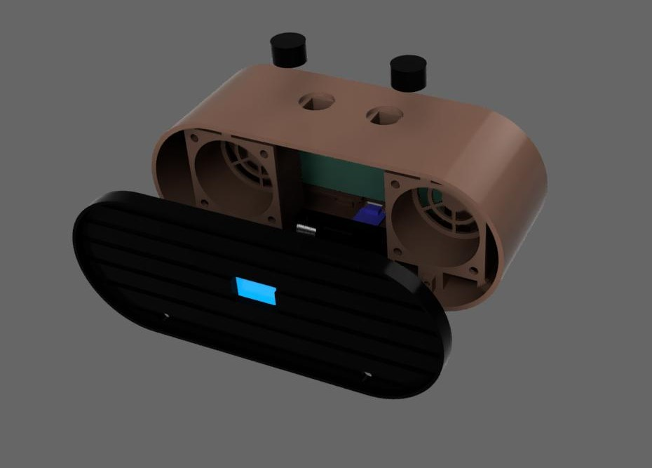
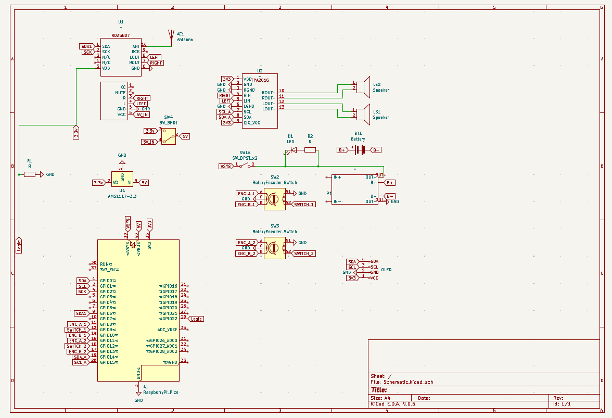
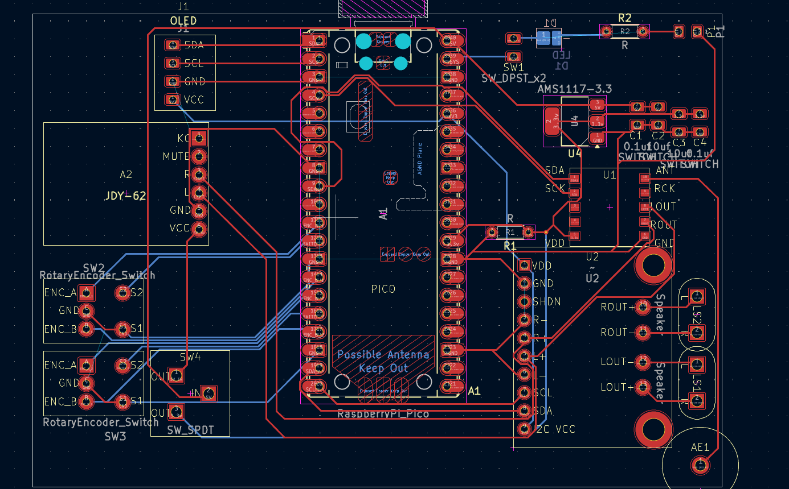

# THE RFR2 - Radio Frequency Receiver 2

## What is it?

The RFR2 is a device that can switch from being an ordinary radio, to being a Bluetooth speaker, with the flip of a switch.

With accesible parts at its core, and most of the wiring job being handled by a PCB, this project is very easy to understand, then assemble.

## Why?

Well, I wanted to make something original, and then I was thinking about getting a Bluetooth speaker. So, why not include a radio module, for when you don't have internet, and give it a modern, minimal design? On top of that, it also forced me to learn how to make a compact PCB, and if you look at the other ones I made, and compare them to this one, I think the goal was at least partially reached. Plus I just loved how it would end up looking, so that was an additional bit of motivation.

## Hardware

### PCB

  Features:

  - Most of the components communicate via I2C. This being the case, volume and channel can be changed using rotary encoders, rather than classic potentiometers.
  - A pin on the microcontroller (Raspberry Pi Pico) detects if there is current flow between the radio module and the 3.3V line. If so, the Pico knows to display "radio mode". If not, it will display "BT mode"
  - The Bluetooth device(JDY-62) does not need any connection to the MCU, so it is just hooked up to the digital amp.
  - The amplifier communicates via I2C, and only one of them handles the amplifying of both of the systems. It leads to 2 5cm speakers
  - A battery pack made uo of a 18650 Li-ion cells should last for a long time, since it has 2500mAh capacity
  - Quality USB-C charger, with overcharge protection
  - STATUS LED!!!
  - Heated inserts, no screws on bare plastic
  
  

### Case

  - I love how the case turned out, with the minimal style, especially the grille and the shallow knobs. I tried to shrink it down as much as possible, so it would use up less plastic, and I also removed a lot of unnecessary parts in the final design.

### Firmware

  I don't have much to say about this, since I am very bad at writing code, so I tried my best to make something that would pass as firmware, but I am pretty sure it doesn't work, and I am waiting for the parts, in order to figure it out one component after the other.

## Assembly

Putting the parts together is pretty straightforward:
  - make sure to first load the firmware on the Pico
  -  For the PCB, you just have to solder all the parts in their designated spots, trying to solder directly to the PCB as little as possible, and using female pin headers wherever possible(OLED, Pico, BT module, amp). The PCB can then be secured using the 3d printed clips
  - After that, you should insert all the heated inserts, into their designated holes(the ones that hold the speakers are M4, the rest are M3)
  - The charger can be glued in place 
  - Screw everything in, and you re pretty much done

## AI usage:

AI was used for research, specifically part selection, and for understanding code.

## Bill Of Materials

| Item                   | Description              | Link                                                                                                                                                                                                                                                                                                                                                                                                                                                                                                                                                                                                                                                               | Qty | Price per unit | Total price w/o shipping | Shipping | Total   |
| ---------------------- | ------------------------ | ------------------------------------------------------------------------------------------------------------------------------------------------------------------------------------------------------------------------------------------------------------------------------------------------------------------------------------------------------------------------------------------------------------------------------------------------------------------------------------------------------------------------------------------------------------------------------------------------------------------------------------------------------------------ | --- | -------------- | ------------------------ | -------- | ------- |
| PCB                    | PCB                      | \-                                                                                                                                                                                                                                                                                                                                                                                                                                                                                                                                                                                                                                                                 | 5   |                | 4.54 €                  | 8.88 €  | 13.42 €|
| M4 bolts               | M4 bolts                 | already owned                                                                                                                                                                                                                                                                                                                                                                                                                                                                                                                                                                                                                                                      | 8   | already owned  | 0.00 €                  | 0.00 €  | 0.00 € |
| M4 nuts                | M4 nuts                  | already owned                                                                                                                                                                                                                                                                                                                                                                                                                                                                                                                                                                                                                                                      | 8   | already owned  | 0.00 €                  |          |         |
| M3 bolts               | M3 bolts                 | already owned                                                                                                                                                                                                                                                                                                                                                                                                                                                                                                                                                                                                                                                      | 8   | already owned  | 0.00 €                  |          |         |
| M3 nuts                | M3 nuts                  | already owned                                                                                                                                                                                                                                                                                                                                                                                                                                                                                                                                                                                                                                                      | 8   | already owned  | 0.00 €                  |          |         |
| SMD2835-6500K          | SMD LED                  | [https://electronicmarket.ro](https://electronicmarket.ro/2835-smd-led-6000-6500k-alb?gad_source=1&gad_campaignid=21513542058&gbraid=0AAAAA-D1O9Z2KXrM8jS931hq9EL83sPFJ&gclid=Cj0KCQjw-pHPBhCdARIsAHXYWP_1JeyVaks436fD8OcetfT-7PHea8UyYtYJ8BzN7zg7yd09QDPxtFgaAkwxEALw_wcB)                                                                                                                                                                                                                                                                                                                                                                                                                       | 1   | 0.06 €        | 0.06 €                  | 2.26 €  | 2.69 € |
| SPDT Slide Switch      | ON-ON Slide Switch       | [https://electronicmarket.ro](https://electronicmarket.ro/en-gb/mini-spdt-slide-switch-on-on-3-pin?search=Switch)                                                                                                                                                                                                                                                                                                                                                                                                                                                                                                                                                                                 | 1   | 0.11 €        | 0.11 €                  |          |         |
| SS12D00                | Mini On-Off Slide Switch | [https://electronicmarket.ro](https://electronicmarket.ro/en-gb/switches-and-buttons/slide-switch/ss12d00-mini-on-off-slide-switch)                                                                                                                                                                                                                                                                                                                                                                                                                                                                                                                                                               | 1   | 0.26 €        | 0.26 €                  |          |         |
| 0.90" OLED Display     | Display                  | [https://sigmanortec.ro](https://sigmanortec.ro/display-oled-096-i2c-iic-alb?SubmitCurrency=1&id_currency=3)                                                                                                                                                                                                                                                                                                                                                                                                                                                                                                                                                                                 | 1   | 3.71 €        | 3.71 €                  | 2.96 €  | 10.84 €|
| 433MHz helical antenna | antenna                  | [https://sigmanortec.ro](https://sigmanortec.ro/en/433mhz-helical-antenna)                                                                                                                                                                                                                                                                                                                                                                                                                                                                                                                                                                                                                   | 1   | 0.60 €        | 0.60 €                  |          |         |
| AMS1117 3.3V           | Voltage regulator        | [https://sigmanortec.ro](https://sigmanortec.ro/Modul-coborator-tensiune-AMS1117-3-3V-p134573098?SubmitCurrency=1&id_currency=3)                                                                                                                                                                                                                                                                                                                                                                                                                                                                                                                                                             | 1   | 0.73 €        | 0.73 €                  |          |         |
| TP4056                 | USB-C charger            | [https://sigmanortec.ro](https://sigmanortec.ro/modul-incarcare-baterie-litiu-tp4056-typec-5v-1a-cu-protectie)                                                                                                                                                                                                                                                                                                                                                                                                                                                                                                                                                                               | 1   | 0.93 €        | 0.93 €                  |          |         |
| 18650 Battery holder   | Battery holder           | [https://sigmanortec.ro](https://sigmanortec.ro/Suport-baterie-18650-p158825500)                                                                                                                                                                                                                                                                                                                                                                                                                                                                                                                                                                                                             | 1   | 1.91 €        | 1.91 €                  |          |         |
| TPA2016D2              | Digital Amplifier        | [https://www.aliexpress.com](https://www.aliexpress.com/item/1005007771780893.html?spm=a2g0o.productlist.main.1.1388WFE4WFE4Bm&algo_pvid=e4d26b52-9606-43dc-8250-c23014e96432&algo_exp_id=e4d26b52-9606-43dc-8250-c23014e96432-0&pdp_ext_f=%7B%22order%22%3A%2235%22%2C%22eval%22%3A%221%22%2C%22fromPage%22%3A%22search%22%7D&pdp_npi=6%40dis%21RON%2153.65%2153.65%21%21%2112.06%2112.06%21%40211b617b17774791883722573e4de4%2112000042149628474%21sea%21RO%214338401437%21ABX%211%210%21n_tag%3A-29910%3Bd%3Aab527837%3Bm03_new_user%3A-29895&curPageLogUid=89HHeY0mkhnZ&utparam-url=scene%3Asearch%7Cquery_from%3A%7Cx_object_id%3A1005007771780893%7C_p_origin_prod%3A)                     | 1   | 10.88 €       | 10.88 €                 | 6.63 €  | 24.82 €|
| 18650 Cell             | Battery                  | [https://www.aliexpress.com](https://www.aliexpress.com/item/32793701336.html?spm=a2g0o.productlist.main.1.48a3184fd8KZS5&algo_pvid=00aa3b3f-57ad-4e47-b5c8-92639a2236e0&algo_exp_id=00aa3b3f-57ad-4e47-b5c8-92639a2236e0-0&pdp_ext_f=%7B%22order%22%3A%2223359%22%2C%22spu_best_type%22%3A%22price%22%2C%22eval%22%3A%221%22%2C%22fromPage%22%3A%22search%22%7D&pdp_npi=6%40dis%21EUR%2143.38%2139.52%21%21%2148.46%2144.15%21%40210398e917845014974487700e0ea5%2112000053301585582%21sea%21RO%210%21ABX%211%210%21n_tag%3A-29910%3Bd%3Aab527837%3Bm03_new_user%3A-29895&curPageLogUid=190jBEObcvpL&utparam-url=scene%3Asearch%7Cquery_from%3A%7Cx_object_id%3A32793701336%7C_p_origin_prod%3A) | 1   | 7.31 €        | 7.31 €                  |          |         |
| M4x6x4 heated inserts  | Heated inserts           | [https://www.drot.ro](https://www.drot.ro/platforma-arduino/231181-inserts-filetate-m4x6x6-din-alama.html?cv)                                                                                                                                                                                                                                                                                                                                                                                                                                                                                                                                                                             | 8   | 0.17 €        | 1.36 €                  | 3.81 €  | 6.53 € |
| M3x6x4 heated inserts  | Heated inserts           | [https://www.drot.ro](https://www.drot.ro/platforma-arduino/231208-inserts-filetate-m3x6x4-din-alama.html?cv)                                                                                                                                                                                                                                                                                                                                                                                                                                                                                                                                                                             | 8   | 0.17 €        | 1.36 €                  |          |         |
| JDY-62A                | Bluetooth module         | [https://www.optimusdigital.ro](https://www.optimusdigital.ro/ro/wireless-bluetooth/12433-modul-pentru-transmisie-audio-fara-fir-ble-stereo-jdy-62a.html)                                                                                                                                                                                                                                                                                                                                                                                                                                                                                                                                           | 1   | 2.80 €        | 2.80 €                  | 2.00 €  | 6.60 € |
| RDA5807                | RF Radio Module          | [https://www.optimusdigital.ro](https://www.optimusdigital.ro/ro/wireless-radio-fm/745-modul-radio-fm-rda5807m.html?srsltid=AfmBOooLRyTUZa3x3IrgBiQJtpdNmcl8UkR8Xkw7ODdx6JqKyL7N7ozU])                                                                                                                                                                                                                                                                                                                                                                                                                                                                                                              | 1   | 1.80 €        | 1.80 €                  |          |         |
| Visaton FR 58          | Speaker                  | [https://www.thomann.ro](https://www.thomann.ro/visaton_fr_58.htm)                                                                                                                                                                                                                                                                                                                                                                                                                                                                                                                                                                                                                           | 2   | 8.22 €        | 16.44 €                 | 9.35 €  | 25.79 €|
| Grand Total            |                          |                                                                                                                                                                                                                                                                                                                                                                                                                                                                                                                                                                                                                                                                    |     | |54.80 €       | 35.89 €                      | 90.69 € |

